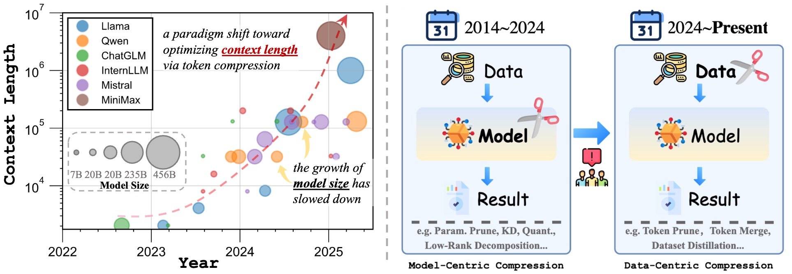
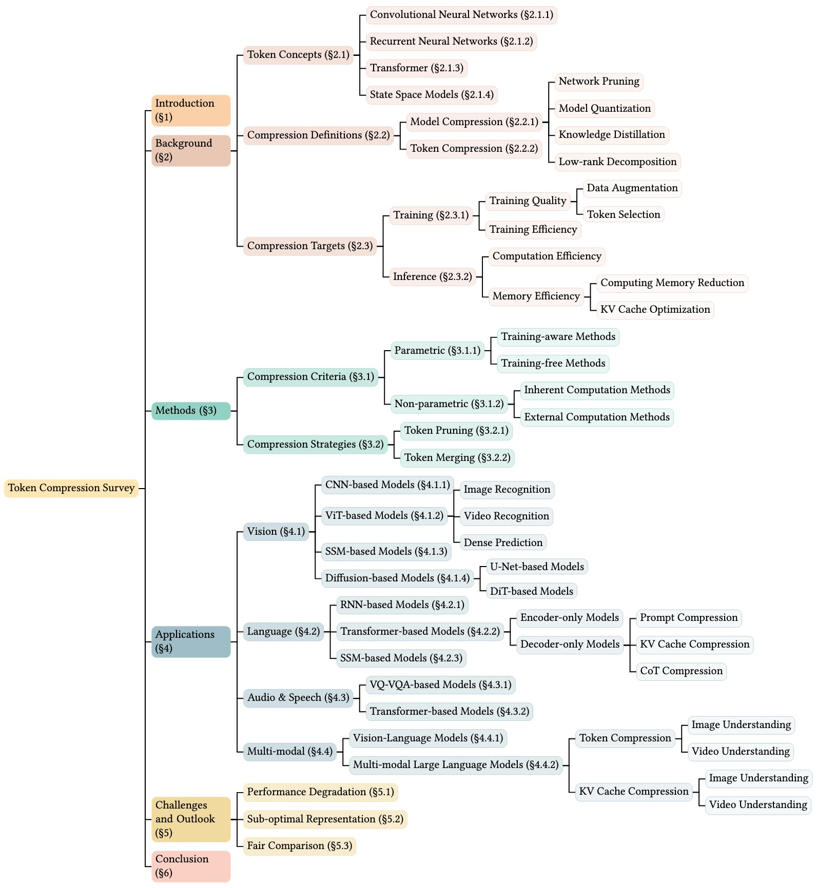

# 🔎 Awesome Token-level Model Compression 🚀

  

## 🔥  *News* 

* **`2024/12/24`** 🤗🤗 We release an open-sourse repo "[Awesome-Token-level-Model-Compression](https://github.com/xuyang-liu16/Awesome-Token-level-Model-Compression)", which collects recent awesome token compression papers! Feel free to contribute your suggestions!

## ✨ Overview

  

> **TLDR:** The evolution of AI efficiency: from model-centric to data-centric compression.

  

> **TLDR:** This work provides a comprehensive review of token compression techniques, examining their development, methodologies, and applications across diverse scenarios..

## 📚  *Contents* 

🖱️ Please click on each domain to explore the applications of token compression across different downstream scenarios.

- [Awesome-Token-level-Model-Compression](README.md)
    - [Vision Domain](https://github.com/xuyang-liu16/Awesome-Token-level-Model-Compression/tree/main/Vision%20Domain)
        - [Understanding](https://github.com/xuyang-liu16/Awesome-Token-level-Model-Compression/blob/main/Vision%20Domain/Understanding.md)
        - [Generation](https://github.com/xuyang-liu16/Awesome-Token-level-Model-Compression/blob/main/Vision%20Domain/Generation.md)
    - [Language Domain](https://github.com/xuyang-liu16/Awesome-Token-level-Model-Compression/blob/main/Language%20Domain/token-reduction-in-language-domain.md)
    - [Multi-Modal Domain](https://github.com/xuyang-liu16/Awesome-Token-level-Model-Compression/tree/main/Multi-modal%20Domain)
        - [Understanding](https://github.com/xuyang-liu16/Awesome-Token-level-Model-Compression/blob/main/Multi-modal%20Domain/Understanding.md)
        - [Generation](https://github.com/xuyang-liu16/Awesome-Token-level-Model-Compression/blob/main/Multi-modal%20Domain/Generation.md)
    - [Audio&Speech Domain](https://github.com/xuyang-liu16/Awesome-Token-level-Model-Compression/blob/main/Audio%26Speech%20Domain/token-reduction-in-audio-speech-domain.md)

## 💬  *Keywords* 
     

## 💻 Related Works

* [Awesome Generation Acceleration](https://github.com/xuyang-liu16/Awesome-Generation-Acceleration): An open-source repository that curates a collection of recent awesome papers on AIGC acceleration.

## 🧑‍💻 Contribution

👏 Thanks to these contributors for this excellent work！

