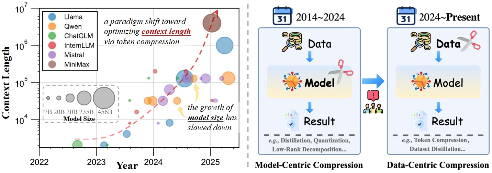

<div align=center>

# 🔎 Awesome Token-level Model Compression 🚀

[](https://github.com/sindresorhus/awesome)

[](https://github.com/Naereen/StrapDown.js/graphs/commit-activity)
[](https://github.com/xuyang-liu16/Awesome-Token-level-Model-Compression)
[](https://github.com/xuyang-liu16/Awesome-Token-level-Model-Compression.git)  


</div>

## 🔥 <span id="head1"> *News* </span>

* **`2025/05/27`** 🙌🙌 We release a new [paper](https://arxiv.org/abs/2505.19147), pointing to **shifting AI efficiency from model-centric to data-eentric compression**. [Project](https://github.com/xuyang-liu16/Awesome-Token-level-Model-Compression) is available! Our paper is honored to be the [#2 Paper of the day](https://huggingface.co/papers/2505.19147)!

* **`2024/12/24`** 🤗🤗 We release an open-sourse repo "[Awesome-Token-level-Model-Compression](https://github.com/xuyang-liu16/Awesome-Token-level-Model-Compression)", which collects recent awesome token compression papers! Feel free to contribute your suggestions!

## ✨ Overview

<p align="center">  </p>

> **TLDR:** We argue that **the focus of research for efficient AI is shifting from model-centric compression to datacentric compression**. To this end, we have compiled a comprehensive summary of **200+ papers** of token-level model compression.


## 📚 <span id="head1"> *Contents* </span>

🖱️ Please click on each domain to explore the applications of token-level model compression across different downstream scenarios. In total, it includes over **200+** awesome papers.

- [Awesome-Token-level-Model-Compression](README.md)
    - [Vision Domain](https://github.com/xuyang-liu16/Awesome-Token-level-Model-Compression/tree/main/Vision%20Domain)
        - [Understanding](https://github.com/xuyang-liu16/Awesome-Token-level-Model-Compression/blob/main/Vision%20Domain/Understanding.md)
        - [Generation](https://github.com/xuyang-liu16/Awesome-Token-level-Model-Compression/blob/main/Vision%20Domain/Generation.md)
    - [Language Domain](https://github.com/xuyang-liu16/Awesome-Token-level-Model-Compression/blob/main/Language%20Domain/token-reduction-in-language-domain.md)
    - [Multi-Modal Domain](https://github.com/xuyang-liu16/Awesome-Token-level-Model-Compression/tree/main/Multi-modal%20Domain)
        - [Understanding](https://github.com/xuyang-liu16/Awesome-Token-level-Model-Compression/blob/main/Multi-modal%20Domain/Understanding.md)
        - [Generation](https://github.com/xuyang-liu16/Awesome-Token-level-Model-Compression/blob/main/Multi-modal%20Domain/Generation.md)
    - [Audio&Speech Domain](https://github.com/xuyang-liu16/Awesome-Token-level-Model-Compression/blob/main/Audio%26Speech%20Domain/token-reduction-in-audio-speech-domain.md)

## 📝 <span id="head1"> *Paper Example* </span>

We use the following tags to summarize key information about each paper:

- **[1] DynamicViT: Efficient Vision Transformers with Dynamic Token Sparsification**, NeurIPS 2021.
  
  *Rao, Yongming and Zhao, Wenliang and Liu, Benlin and Lu, Jiwen and Zhou, Jie and Hsieh, Cho-Jui.*

  [[Paper](https://arxiv.org/abs/2106.02034)] [[Code](https://github.com/RaoYongming/DynamicViT)]       

  <details> <summary>BibTex</summary>

  ```text
  @inproceedings{Rao2021:DynamicViT,
    title={{DynamicViT}: Efficient Vision Transformers with Dynamic Token Sparsification},
    author={Yongming Rao and Wenliang Zhao and Benlin Liu and Jiwen Lu and Jie Zhou and Cho{-}Jui Hsieh},
    booktitle=NIPS,
    volume={34},
    pages={13937--13949},
    year={2021}
  }
  ```
  </details>  

We have summarized detailed information about the paper's method abbreviation, downstream application tasks, compression method classification, BibTex reference format etc. through the following tags:

     


## 💻 Related Works

* [Awesome Generation Acceleration](https://github.com/xuyang-liu16/Awesome-Generation-Acceleration): An open-source repository that curates a collection of recent awesome papers on AIGC acceleration.

## 📌 Citation

Please consider citing our paper in your publications, if our findings help your research.

```bibtex
@article{liu2025shifting,
  title={Shifting AI Efficiency From Model-Centric to Data-Centric Compression},
  author={Liu, Xuyang and Wen, Zichen and Wang, Shaobo and Chen, Junjie and Tao, Zhishan and Wang, Yubo and Jin, Xiangqi and Zou, Chang and Wang, Yiyu and Liao, Chenfei and Zheng, Xu and Chen, Honggang and Li, Weijia and Hu, Xuming and He, Conghui and Zhang, Linfeng},
  journal={arXiv preprint arXiv:2505.19147},
  year={2025}
}
```

## 🧑‍💻 Contribution

👏 Thanks to these contributors for this excellent work！

<a href="https://github.com/xuyang-liu16/Awesome-Token-level-Model-Compression/graphs/contributors">
  
</a>

## ✨ Star History

[](https://www.star-history.com/#xuyang-liu16/Awesome-Token-level-Model-Compression&Timeline)
